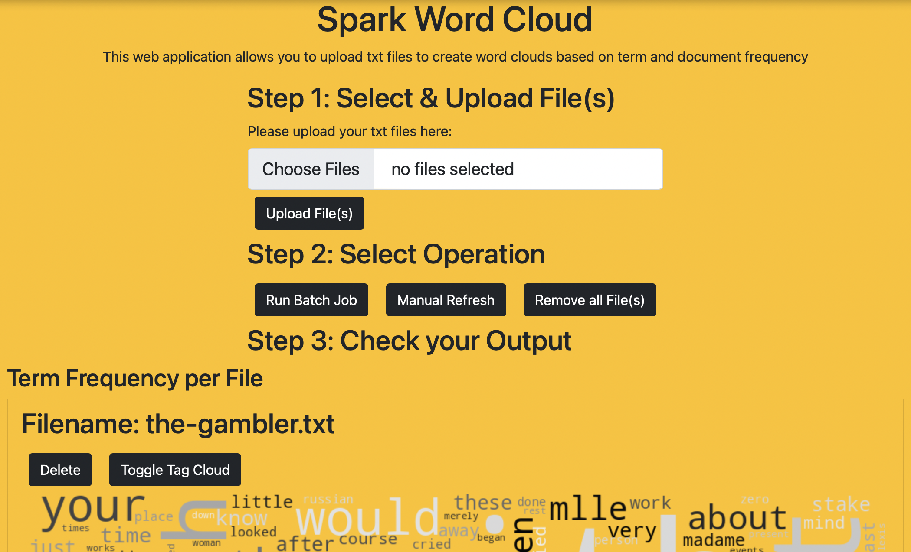

# Spark Wordcloud

Generate word clouds from large text files and determine term and document frequency across several documents.

[](https://gitpod.io/#https://github.com/Miracle-Fruit/spark-wordcloud)



## Demo Video

--insert video--

## Documentation

--insert text--


You can also view or download the [PDF Documentation]().

## Development

You can easily develope this application by opening up GitPod (see above) and have the whole environemt up and running. Alternatively you can clone the repo and develope locally - simply run the following commands from the roor of the repository:

```bash
docker-compose -f webapp/docker-compose.yml up
```

Worker can be scaled with:
```bash
docker-compose -f webapp/docker-compose.yml up --scale spark-worker=2
```

## Sources

### Text File Sources

* [The Grand Inquisitor by Fyodor Dostoyevsky](https://www.gutenberg.org/ebooks/8578)
* [The Brothers Karamazov by Fyodor Dostoyevsky](https://www.gutenberg.org/ebooks/28054)
* [The Gambler by Fyodor Dostoyevsky](https://www.gutenberg.org/ebooks/2197)
* [The Idiot by Fyodor Dostoyevsky](https://www.gutenberg.org/ebooks/2638)