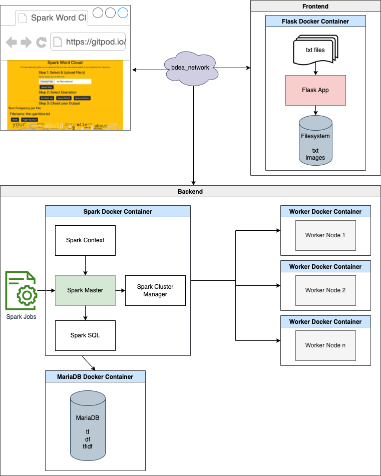

# Spark Wordcloud

Generate word clouds from large text files and determine term and document frequency across several documents.

[](https://gitpod.io/#https://github.com/Miracle-Fruit/spark-wordcloud)


## Demo Video

[](https://youtu.be/TN-JgBMii6w)

[Open the Presentation PDF](presentation.pdf)

## Documentation

Our infrastructure is based on Docker Containers, we placed each service on a single container (refer to the diagram below):

* Flask (Webapp and file system)
* Apache Spark (Spark Setup and Master)
* Worker Nodes 1..n (Apache Spark Worker Nodes)
* MariaDB (Database)

All of those systems use the docker bridge network *bdea_network* to communicate with each other. An HTML with Bootstrap forms the Webapp for our Flask Frontend and allows the user to upload text files. The Webapp offers to execute two Spark Jobs:

1. `tf_job` which is executed every time a new text file is uploaded on the website
2. `df_job` which is the batch job that can be manually executed to generate the global term frequency word cloud based on the document frequency

The data generated from the Spark Jobs are saved in MariaDB. MariaDB has three tables that are initialized on startup:

- tf (stores the term frequency for all documents)
- df (stores the document frequency for all words)
- tfidf (stores the TFIDF value for each document)

Due to its setup, Spark distributed the workload between the available worker nodes (please read below on how to scale them).

### Architecture

The following image is a visualization of the description above:



### Challenges & Problems

* Read and write in the same spark job -> can cache the table 
* Special characters are not correctly saved in database -> change char_set and collate to utf-8
* Queries in SQL are sometimes not so easy 
* Bootstrap elements center -> frontend was annoying
* Setup with database and JDBC Driver -> link driver by spark-submit and in docker-image
* Docker setup with all components -> try and error until it works
* Spark Jobs depends strongly on systems hardware  e. g. 4 MB .txt-file  PC ->  11-20sec, laptop -> 2-3min

You can also view or download the documentation as a [PDF Document](documentation.pdf).

## Development

You can easily develope this application by opening up GitPod (see above) and have the whole environemt up and running. Alternatively you can clone the repo and develope locally - simply run the following commands from the root of the repository:

```bash
docker-compose -f webapp/docker-compose.yml up
```

Worker can be scaled with `--scale spark-worker`:

```bash
docker-compose -f webapp/docker-compose.yml up --scale spark-worker=2
```

## Sources

### Text File Sources

* [The Grand Inquisitor by Fyodor Dostoyevsky](https://www.gutenberg.org/ebooks/8578)
* [The Brothers Karamazov by Fyodor Dostoyevsky](https://www.gutenberg.org/ebooks/28054)
* [The Gambler by Fyodor Dostoyevsky](https://www.gutenberg.org/ebooks/2197)
* [The Idiot by Fyodor Dostoyevsky](https://www.gutenberg.org/ebooks/2638)
